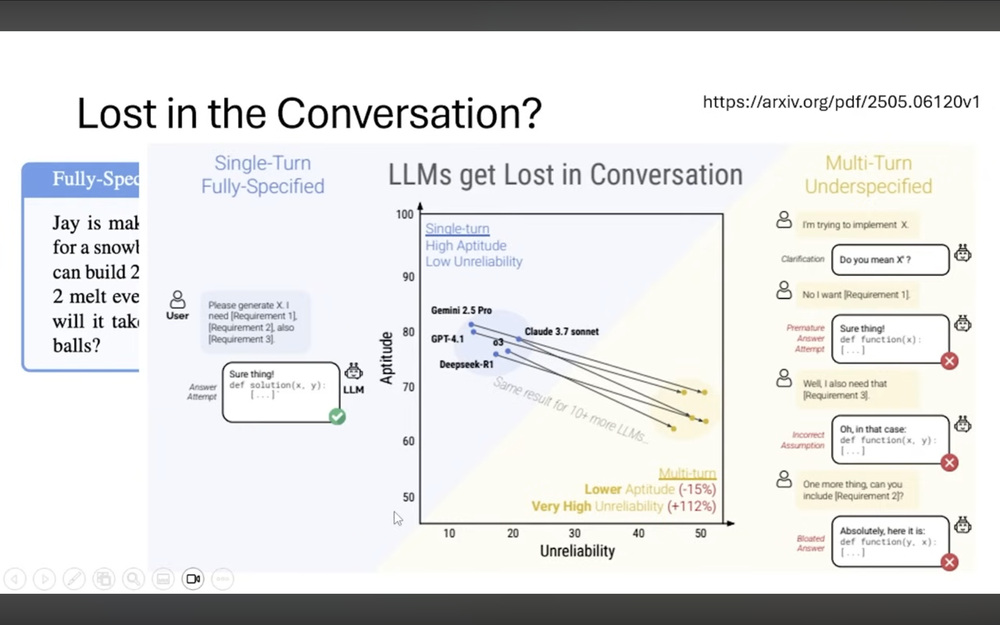
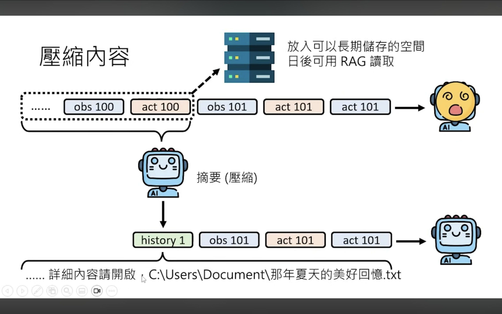

本文為[【生成式人工智慧與機器學習導論 2025】第 2 講：上下文工程 (Context Engineering) — AI Agent 背後的關鍵技術](https://www.youtube.com/watch?v=lVdajtNpaGI) 筆記

---

## Overview

### Context Engineering

### Tool Use

### Evolution of Context Window Size

### What is in the Context

### What is AI Agent

## Issue

### Long Context RAG Performance

### Lost in the Conversation

### Lost in the Middle

## Solution

### Select/RAG

### Select/Memory

### Compress

### Multi Agent

## Conclusion

LLM 本質上只做一件事，根據輸入（prompt）來預測下一個要輸出的 token，可以寫作 `f(x)`，而 `f()` 就是 LLM 本身。由於訓練 LLM 的成本太高，提升成效的唯一手段只剩下調整 x，也就是 prompt，因此 context engineering 本質上跟 prompt engineering 是指同一件事，~~只是 context 更潮。~~ （應該是說 prompt 時代的魔法咒語隨著模型本身的進步而逐漸失效，在 2025 提供完整的語境脈絡比鑽研咒語更有效果，因此才從 prompt 這個詞演變成 context）

雖然 context window 的上限在過去幾年間有顯著提升，但目前「有效輸入」遠小於「輸入上限」，另外模型與人類同樣受 [Serial-position effect](https://en.wikipedia.org/wiki/Serial-position_effect) 影響。因此發展其他 Solution 現階段仍然是必要的。現行手段主要有三：挑選（Select）、壓縮（Compress）以及 Multi Agent。

挑選（Select）的部分從傳統的 RAG 技術，發展到結合搜尋引擎，並且在每個環節都可以搭配「更小」的語言模型來協助篩選相關的內容。強調更小則是為了提高速度、提升使用體驗。挑選（Select）與壓縮（Compress）這兩項技術則共同優化了「長期記憶」的效果。最單純的壓縮技術可能是遞回壓縮，例如將每 100 輪對話摘要成一段 history_1，而 history_1 也會跟後來的 100 輪對話壓縮成 history_2，為了避免早期資訊逐漸被稀釋掉，可以另外儲存搭配 RAG 技術讀取，也可以留下「hint」做出 index 的效果。

最後一個技術是 Multi Agent，本質上就是將任務拆分到不同到 Agent 身上來達到分散 Context 的效果。有趣的是在簡單任務做拆分的效果反而會下降。LLM 不管在記憶、認知表現或分工合作等方面都跟人類實在太像了，真酷！
