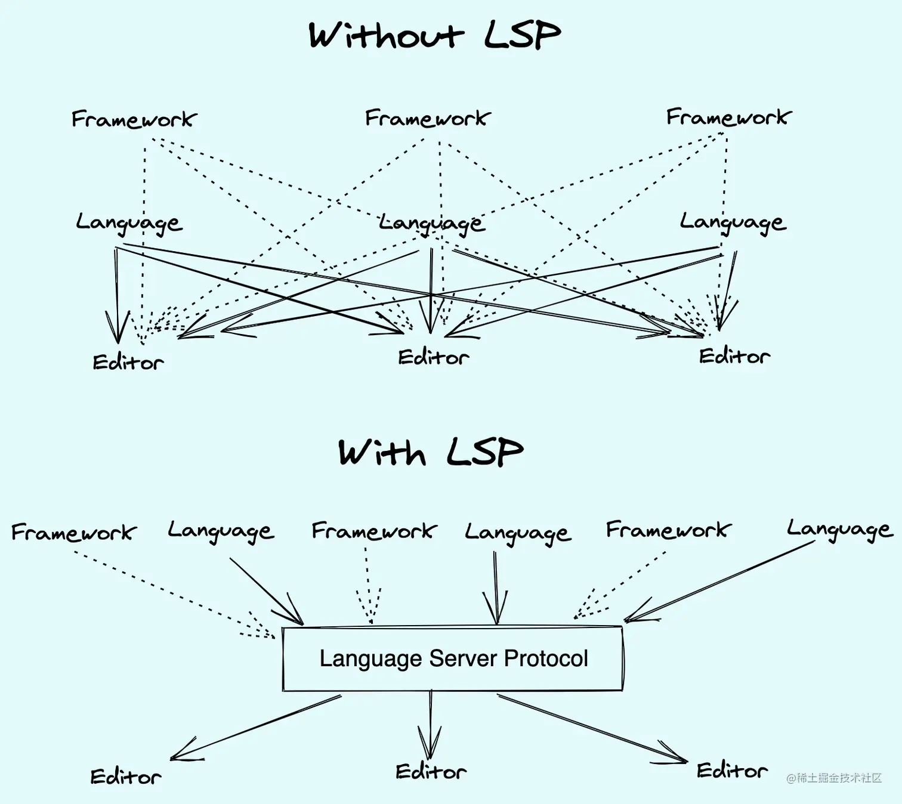
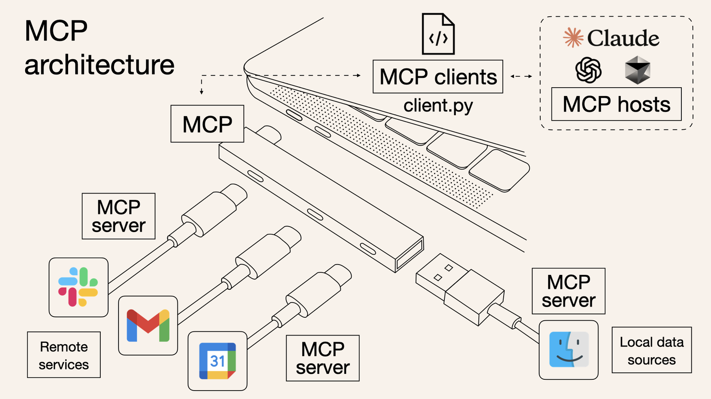

## 先講 LSP

在 VSCode 誕生之前，許多 IDE 早已具備 **syntax highlight、error hint、auto complete** 等功能。然而，缺乏統一標準導致 **M 種 IDE × N 種程式語言** 需要開發 **M × N** 種 Language Server，才能完整支援這些功能，開發與維護成本極高。微軟在 2016 年創造 VSCode 時，順勢提出了 **LSP（Language Server Protocol）**，讓 IDE 專注於通用 UI，而語言相關功能則交由獨立的 **Language Server** 負責。透過這種標準化協議，VSCode 能夠與不同語言的分析工具統一溝通，將複雜度從 **M × N** 降為 **M + N**，大幅提升開發效率，並促成了 LSP 成為業界標準。

## 再談 MCP

如果說 LSP 解決了 IDE 的問題，那 MCP 就是為了解決 AI Agent 的問題。套過一套統一標準來銜接 LLM 與其他 App 的互動。

## Resources

- 這邊有很多發展中的 [MCP Server](https://github.com/punkpeye/awesome-mcp-servers)

- 開發可用 [SDK](https://github.com/modelcontextprotocol)

## Reference

- https://microsoft.github.io/language-server-protocol/overviews/lsp/overview/
- https://nshipster.com/model-context-protocol/
