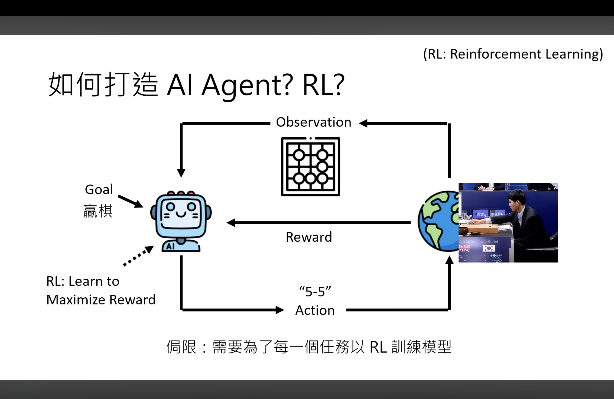
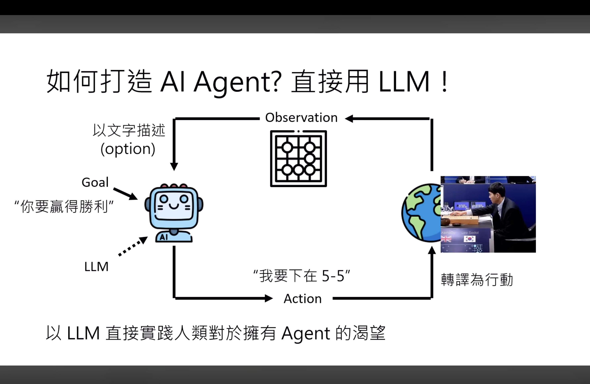
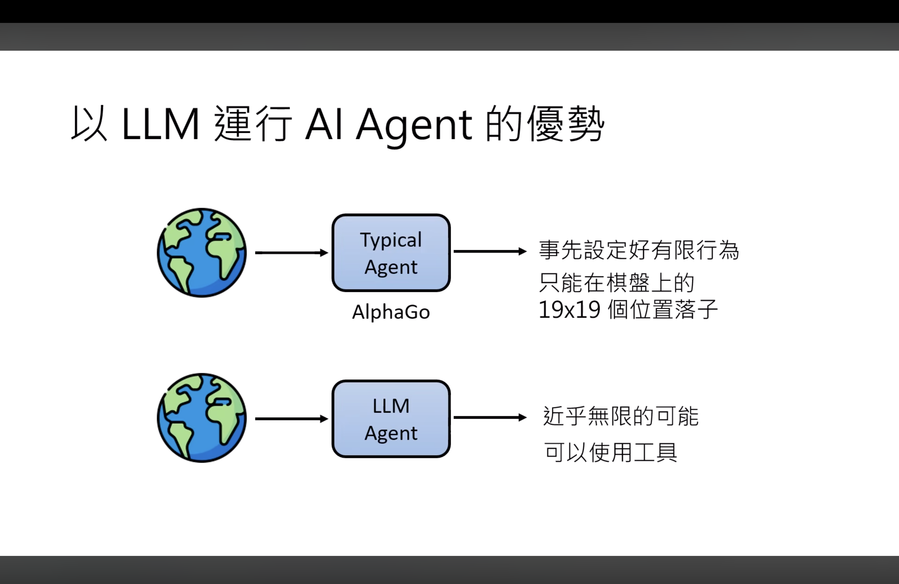
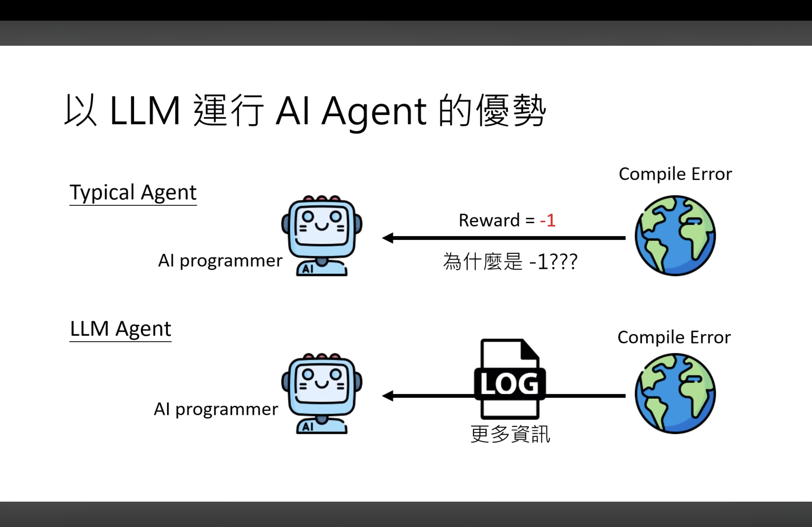
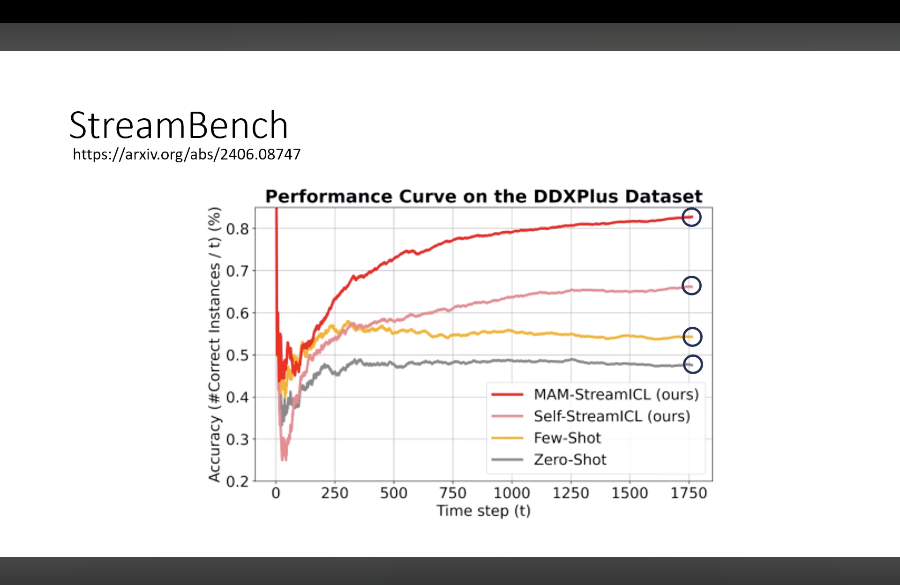

本文為[【生成式 AI 時代下的機器學習(2025)】第二講：一堂課搞懂 AI Agent 的原理](https://www.youtube.com/watch?v=M2Yg1kwPpts) 筆記

---

## RL Agent vs LLM Agent

在 LLM 時代以前就存在基於 Reinforcement Learning 的 AI Agent，其特色是單一模型專注於單一任務，例如[下圍棋的 AlphaGo](https://zh.wikipedia.org/zh-tw/AlphaGo)。

以 LLM 運行的 Agent 的明顯優勢是「近乎無限可能的輸出」（只要再搭配正確的 Tool 就會變成無所不能），此外也不需要再人為介入設定 Reward，直接提供更真實且豐富的資訊即可互動。

## StreamBench

模型有沒有辦法自主學習呢？如果提供一個「記憶模組」讓模型將處理過的問題記錄下來，後續透過 RAG 的方式，其成效顯著高於隨機抽選問題做 `few-shot`，或甚至不給範例的 `zero-shot`。至於 MAM (Multi-Agentic-Memory) 之所以會有最好的表現，是因為它讓多個具不同特性的 Agent 共同參與學習，每個 Agent 在輪流作答中貢獻各自的成功案例，而這些案例會被存入共享記憶庫中。當記憶逐漸豐富後，後來的 Agent 在推理時能引用更多多樣且高品質的範例，形成一種「群體智慧式的持續學習」。這種設計不僅避免了單一模型侷限，也兼顧了多樣性與穩定性，使得 MAM-StreamICL 在長期表現上遠超其他基線模型。

> Overview of StreamBench, illustrating the continuous improvement process of language agents in streaming. [Ref..](https://github.com/stream-bench/stream-bench)

