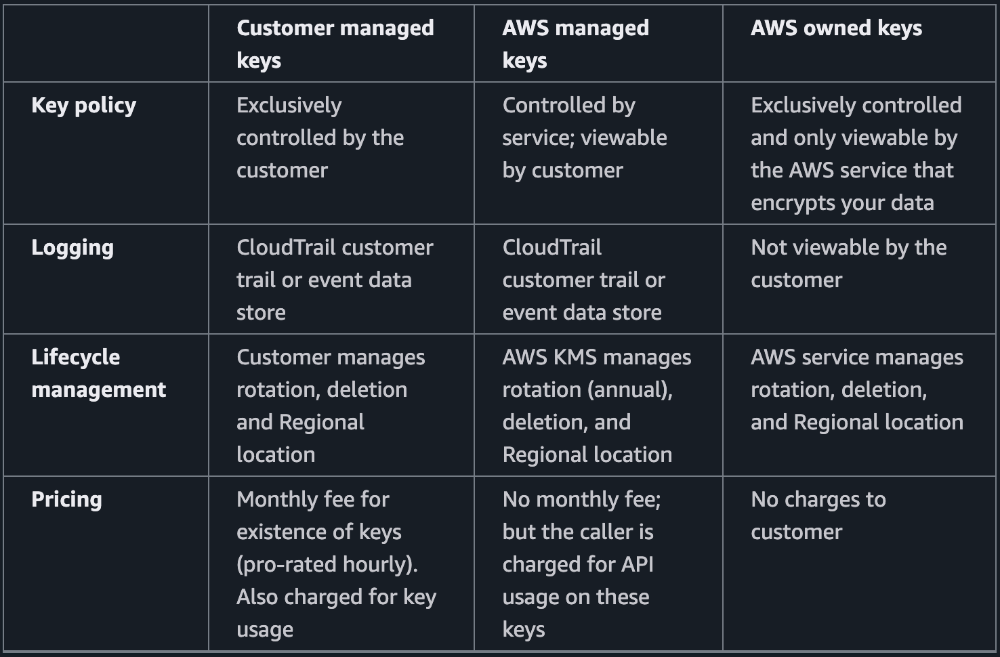
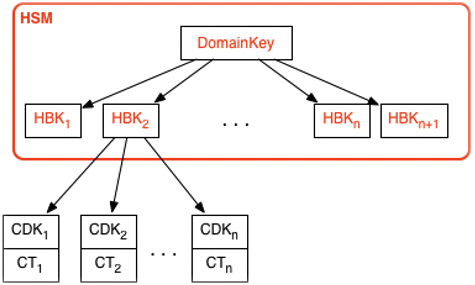
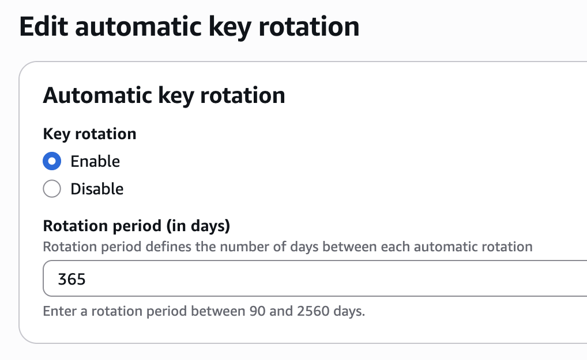

## 前言

密鑰管理是資訊安全中不可或缺的一環，確保敏感資料在儲存與傳輸過程中受到保護。AWS Key Management Service（KMS）是一項由 AWS 提供的雲端密鑰管理服務，協助使用者安全地建立、管理及控制加密金鑰，簡化密鑰管理流程並降低運維成本。KMS 依循 [FIPS 140-3 Security Level 3 validated hardware security modules (HSM)](https://csrc.nist.gov/projects/cryptographic-module-validation-program/certificate/4884) 標準，確保密鑰儲存於高安全性的硬體設備中。

KMS 具備多項功能，包括：

- 支援多種加密演算法（如 AES、RSA、ECC、HMAC）
- 自動化金鑰輪替（rotation）與審計記錄（audit logging）
- 與 AWS 各項服務（如 S3、EBS、RDS、Lambda）深度整合
- 透過 IAM 控制金鑰存取權限，細緻管理使用者與服務的操作
- 支援 Bring Your Own Key（BYOK）、外部金鑰管理（XKS）、CloudHSM 整合
- 提供 Envelope Encryption、Data Key 產生等進階加密機制

KMS 協助企業達成合規要求與資安目標，並能彈性擴展至多區域、多帳號的雲端環境，適用於各種規模的組織。

---

## Concepts

### Key type

AWS KMS 支援三種主要的金鑰類型：

- **Customer Managed Key (CMK)**  
  由使用者建立與管理，可自訂權限、輪替、審計等設定。CMK 可用於加密、解密、簽名、驗證等多種用途，適合需要高度自訂化的資安需求。

- **AWS Managed Key (AMK)**  
  由 AWS 服務自動建立與管理，使用者無需手動操作。AMK 主要用於 AWS 服務（如 S3、EBS）自動加密資料，管理簡便但自訂性較低。相較於 AOK，在單一帳號內作用於單一服務。

- **AWS Owned Key (AOK)**  
  完全由 AWS 管理，使用者無法存取或設定。AOK 用於 AWS 內部加密作業，僅限 AWS 服務本身使用，無法直接用於客戶資料加密。相較於 AMK，同時作用於多帳號中的多個服務。



> AWS managed keys are a legacy key type that is no longer being created for new AWS services as of 2021. Instead, new (and legacy) AWS services are using what’s known as an AWS owned key to encrypt customer data by default. More details: https://docs.aws.amazon.com/kms/latest/developerguide/concepts.html

### Create Key Option

建立 Key 的時候根據「material 由誰產生」&「儲存在哪裡」可以分成四種類型：

| 選項                  | **Inside AWS**                                                                | **Outside AWS**                                                                   |
| --------------------- | ----------------------------------------------------------------------------- | --------------------------------------------------------------------------------- |
| **Store in AWS**      | 🔹 **KMS（預設）**<br>Key material 由 AWS KMS HSM 產生並持久保存              | 🔶 **Import key material**<br>你自產並匯入 AWS KMS 儲存                           |
| **Not stored in AWS** | 🔸 **AWS CloudHSM key store**<br>Key material 由你專屬 HSM 產生，不離開該 HSM | 🔺 **External Key Store (XKS)**<br>金鑰 material 永遠存在外部系統，AWS 僅代理 API |

> 以上分類僅針對 symmetric key encrypt/decrypt 用途，HMAC 及 asymmetric 不支援 Cloud HSM / External Key store。

### Hierarchy

根據 [Key Hierarchy](https://docs.aws.amazon.com/kms/latest/developerguide/concepts.html#key-hierarchy) 的概念，當我們 create 一把 symmetric key 時，實際上會發生的事件如下：

1. 建立一個 Logical Key Container

   - 包含 metadata：Usage (Enc vs Dec or HMAC)、KeySpec（SYMMETRIC_DEFAULT）、啟用狀態、Key Policy 等。
   - 支援輪換、審計、封存等行為

2. 在 AWS HSM 中產生 HSM Backing Key（HBK）

   - KMS 會在背景透過 HSM 執行 GenerateKey 操作，產生第一個對稱 key（128/256-bit AES key）
   - 此 HBK 是真正在執行 Encrypt / Decrypt 的實體 key material

3. 使用 Domain Key 將 HBK 封裝為 EKT

   - 為了能離開 HSM 儲存，HBK 會被 KMS 所屬區域的 Domain Key 加密，產生封裝後的 Encrypted Key Token（EKT）
   - EKT 安全儲存在 highly durable, low-latency storage 中。

4. Key rotation support (Optional)
   - HBK 可視為特定版本的 key
   - 啟用 rotation 後會產生新版本的 HBK
   - 所有版本的 HBK 都綁在同一把 logical key 上，僅最新版本用於加密，舊版本保留用於解密（不能交叉使用）



在這個架構底下，一次 KMS 運算流程如下：

> KMS 讀取 EKT > 載入至 HSM memory > 透過 domain key 還原成 HBK > 使用 HBK 執行運算（加解密）> HBK 自 Memory 中釋放。

---

## Usage

### Create Key

```
aws kms create-key
```

> 預設會建立一把 `symmetric`，可以透過 `--key-spec` 指定不同類型的 key，例如 HMAC / RSA / ECC

```
{
    "KeyMetadata": {
        "AWSAccountId": "123456789012",
        "KeyId": "0ae02ac0-f97c-4ee6-ac4b-e746e42e1681",
        "Arn": "arn:aws:kms:ap-northeast-1:123456789012:key/0ae02ac0-f97c-4ee6-ac4b-e746e42e1681",
        "CreationDate": "2025-07-27T13:26:06.080000+08:00",
        "Enabled": true,
        "Description": "",
        "KeyUsage": "ENCRYPT_DECRYPT",
        "KeyState": "Enabled",
        "Origin": "AWS_KMS",
        "KeyManager": "CUSTOMER",
        "CustomerMasterKeySpec": "SYMMETRIC_DEFAULT",
        "KeySpec": "SYMMETRIC_DEFAULT",
        "EncryptionAlgorithms": [
            "SYMMETRIC_DEFAULT"
        ],
        "MultiRegion": false
    }
}
```

### Alias

可以接著建立 alias 方便使用

```
aws kms create-alias --alias-name alias/test --target-key-id 0ae02ac0-f97c-4ee6-ac4b-e746e42e1681
```

> **alias name 一定要加 `alias/`**

之後就可以用 alias 來使用這把 key

```
aws kms describe-key --key-id alias/test
```

### Rotate

至於 rotation 的部分，KMS 支援以天為單位自動 rotate，期間限制為 90 天至 2560 天。


> 另外針對 **symmetric key** 還可以額外執行 on-demand rotate，最多可執行十次。

### Encrypt / Decrypt

Encrypt:

```
aws kms encrypt --key-id alias/test --plaintext aGVsbG8K

{
    "CiphertextBlob": "AQICAHjROnjSmKd/rUcfZS+nVV/RbO26mFJ/diWzjFouY146KwH6IS9Wmi3rtIQAhovBtQ99AAAAZDBiBgkqhkiG9w0BBwagVTBTAgEAME4GCSqGSIb3DQEHATAeBglghkgBZQMEAS4wEQQMi26tmrx3e9tAv30WAgEQgCHfNdCHxG0YIuHmzQEInAhZXH2wcwUg4ogGdsb7XjDoAR0=",
    "KeyId": "arn:aws:kms:ap-northeast-1:123456789012:key/0ae02ac0-f97c-4ee6-ac4b-e746e42e1681",
    "EncryptionAlgorithm": "SYMMETRIC_DEFAULT"
}
```

Decrypt:

```
aws kms decrypt  --ciphertext-blob AQICAHjROnjSmKd/rUcfZS+nVV/RbO26mFJ/diWzjFouY146KwH6IS9Wmi3rtIQAhovBtQ99AAAAZDBiBgkqhkiG9w0BBwagVTBTAgEAME4GCSqGSIb3DQEHATAeBglghkgBZQMEAS4wEQQMi26tmrx3e9tAv30WAgEQgCHfNdCHxG0YIuHmzQEInAhZXH2wcwUg4ogGdsb7XjDoAR0=

{
    "KeyId": "arn:aws:kms:ap-northeast-1:123456789012:key/0ae02ac0-f97c-4ee6-ac4b-e746e42e1681",
    "Plaintext": "aGVsbG8K",
    "EncryptionAlgorithm": "SYMMETRIC_DEFAULT"
}
```

### Generate Data Key

實務上如果使用 KMS 提供的 Encrypt / Decrypt 在大規模使用時可能會採到 [rate limit](https://docs.aws.amazon.com/kms/latest/developerguide/throttling.html) 的限制，因此會另外建立一把 Data key 搭配 [Envelope encryption](https://docs.aws.amazon.com/kms/latest/developerguide/kms-cryptography.html#enveloping)。

```
aws kms generate-data-key \
  --key-id alias/test \
  --key-spec AES_256 \
  --output json > datakey.json

{
    "CiphertextBlob": "...", # 加密過的 Data Key（要保存）
    "Plaintext": "...", # 明文 Data Key（用來加密資料）
    "KeyId": "..."
}
```

Encrypt with data key

```
IV=$(openssl rand -hex 16) # 每次都要使用不同的 IV
PLAINTEXT_KEY=$(jq -r '.Plaintext' datakey.json | base64 -d)

openssl enc -aes-256-cbc -K $(echo -n "$PLAINTEXT_KEY" | xxd -p -c 256) \
  -iv $IV \
  -in plaintext.txt -out ciphertext.bin
```

Decrypt with data key

```
openssl enc -d -aes-256-cbc -K $(echo -n "$PLAINTEXT_KEY" | xxd -p -c 256) \
  -iv $IV \
  -in ciphertext.bin -out recovered.txt
```

> 也可以用 `aws kms generate-data-key-without-plaintext` 搭配 `aws kms decrypt` 得到 plain data key 做使用。

### Grant

相較於 Key Policy，Grant 更適合程式化、暫時性且跨帳號的授權場景。

#### 建立 Grant

```bash
aws kms create-grant \
  --key-id 0ae02ac0-f97c-4ee6-ac4b-e746e42e1681 \
  --grantee-principal arn:aws:iam::098765432109:role/admin \
  --operations Decrypt DescribeKey \
  --output json


{
    "GrantToken": "AQpAM2RhODkzZGYtNTVlMS00Y...",
    "GrantId": "e5ab6810c352be35..."
}
```

切換到 `arn:aws:iam::098765432109:role/admin` 這個身份

```
 aws kms encrypt \
  --key-id arn:aws:kms:ap-northeast-1:123456789012:key/0ae02ac0-f97c-4ee6-ac4b-e746e42e1681 \
  --plaintext aGVsbG8K

is not authorized to perform: kms:Encrypt on this resource because the resource does not exist in this Region, no resource-based policies allow access, or a resource-based policy explicitly denies access
```

合理，因為我們的 grant 當中沒有允許 Encrypt 的選項，至於 Decrypt 則可以正常運作：

```
aws kms decrypt  --ciphertext-blob AQICAHjROnjSmKd/rUcfZS+nVV/RbO26mFJ/diWzjFouY146KwH6IS9Wmi3rtIQAhovBtQ99AAAAZDBiBgkqhkiG9w0BBwagVTBTAgEAME4GCSqGSIb3DQEHATAeBglghkgBZQMEAS4wEQQMi26tmrx3e9tAv30WAgEQgCHfNdCHxG0YIuHmzQEInAhZXH2wcwUg4ogGdsb7XjDoAR0=

{
    "KeyId": "arn:aws:kms:ap-northeast-1:123456789012:key/0ae02ac0-f97c-4ee6-ac4b-e746e42e1681",
    "Plaintext": "aGVsbG8K",
    "EncryptionAlgorithm": "SYMMETRIC_DEFAULT"
}
```

另外文件提到 grant 可能會有一些延遲，如果要立即使用可以透過帶上 grant-token 的方式，但本次實測還滿快的沒用到 token。
