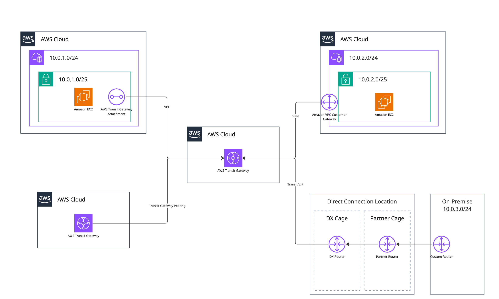

AWS 網路架構基本上可以分成幾種

## Single VPC

一個基本的 VPC 大致上長這樣：

完全獨立的網路環境，無法對外連網，外部也無法存取。

如果希望 VPC 能對外或對內，首先需要啟用 Internet Gateway，並且新增一條 route，將流量導往 Internet Gateway。
|dest|target|
|:-:|:-:|
|0.0.0.0/0|igw-xxx|

> Internet Gateway 是雙向的，如果希望只放行對外流量，可以使用 [egress-only internet gateway](https://docs.aws.amazon.com/zh_tw/vpc/latest/userguide/egress-only-internet-gateway.html)，但僅限 ipv6，不支援 ipv4。

另外對外連網還會需要 public ip，前面有提到 Internet Gateway 是雙向放行的，因此為了聯網而配發 public ip 之後，外部同時也能存取到我們的 resources，為了保護 resource 一般會搭配 NAT 來做轉發，如下圖：

如果想要進一步提升安全性，我們可以透過 VPC Endpoint，限制存取 AWS 的流量全部透過 AWS 內網（AWS Private Link）。VPC Endpoint 除了可以套用 Security group 來限制存取之外，還可以加上 policy 來做權限控管。

其中 Gateway Endpoint 會直接透過靜態路由控制流量，而 Interface Endpoint 則會透過 Private DNS，將 AWS Service Domain 解析成一個特定 ENI 的 IP。

我們也可以透過 NLB 來創建私有的 endpoint service，讓同 region 的其他 VPC 透過 Private Link 來存取服務。但這個做法只能針對特定服務單向傳輸，如果有更強烈的互通需求我們就要使用 VPC Peering 了。

## Multi VPC

VPC Peering 允許兩個 VPC 之間建立私有連線，使其內部資源可以互相通訊。這種連線是 point-to-point，無法轉發第三方流量（不支援 transitive routing），因此如果有多個 VPC 需要互通，必須為每一對 VPC 分別建立 peering 連線。

建立 VPC Peering 後，雙方需要在 route table 中新增對應的路由，才能讓流量正確導向對方 VPC。安全性方面，還需調整 security group 和 network ACL，允許來自對方 VPC 的流量。

VPC Peering 的限制在於僅支援同 region 的 AWS VPC，若是跨雲、混合雲、延伸機房等架構，就必須使用 Site-to-Site VPC 或 Direct Connect 的技術來實現。

## On-Prem Extension

建立 s2s vpn 首先要先在 AWS 上填寫 custom gateway 的資訊（IP / ASN），並且建立 virtual private gateway（宣告一個 private ASN），最後將兩端 Gateway 建立 vpn connection 即可（建議使用 BGP 動態路由）。

當兩條 VPN 通道（tunnel）都處於 UP 狀態時，AWS 端會自動選擇其中一條通道傳送流量，且無法由客戶端指定 AWS 應該使用哪一條通道。客戶端也無法透過 API 或管理控制台查詢 AWS 目前實際使用的通道，只能透過觀察流量來源或 CloudWatch 指標來推測。

相對地，客戶端（CGW）則可以自行選擇要使用哪一條通道傳送流量。如果使用 BGP，當 AWS 對某條通道發送較低的 multi-exit discriminator (MED) 時，建議優先使用該通道，因為另一條通道可能即將維護。

> 若 AWS 和客戶端分別選擇不同的通道，會產生非對稱路由（asymmetric routing）。如果客戶端閘道設備不支援非對稱路由，將導致連線異常。

Direct Connect（DX）是 AWS 提供的專線連線服務，讓企業能將本地資料中心直接連接到 AWS，繞過公有網際網路，提升連線的穩定性、速度與安全性。DX 適合對網路延遲、頻寬或安全性有較高需求的場景。

DX 連線有兩種主要型態：

- **Dedicated Connection**：企業直接向 AWS 申請，頻寬選擇較大（1Gbps、10Gbps、100Gbps），需到 DX Location 佈線，適合高頻寬需求。
- **Hosted Connection**：由 AWS 合作夥伴（DX Partner）提供，頻寬彈性（50Mbps~10Gbps），不需自行佈線，適合彈性需求。

建立 DX 連線時，需在 AWS 上建立 Virtual Interface（VIF）：

- **Private VIF**：連接到 VPC，適合內部資源存取。
- **Public VIF**：連接到 AWS 公有服務（如 S3、DynamoDB）。
- **Transit VIF**：連接到 Transit Gateway，適合多 VPC 或多帳號環境。

在建立 Private VIF 時可選擇對接 VGW or DXGW，主要考量如下：

| 使用情境                                      | 選擇                              | 原因                                                |
| --------------------------------------------- | --------------------------------- | --------------------------------------------------- |
| 僅連線到**同一個 VPC**，**同一區域**          | **Virtual Private Gateway (VGW)** | 簡單直接，設定少，對接單一 VPC 足夠                 |
| 要連接**多個 VPC**（含**跨帳號**）            | **Direct Connect Gateway (DXGW)** | 支援一對多 VPC 連線，最多 10 個 attachment          |
| 要跨 **region** 連線 VPC                      | **DXGW**（必選）                  | VGW 僅支援同區域，DXGW 支援跨區                     |
| 已有 VPN 接在 VPC（使用 VGW）                 | **VGW** 或可共用                  | Private VIF 可對接同一 VGW 作為 VPN + DX 終端點     |
| 想把 DX 與多個 VPC 的對接權限給不同帳號使用者 | **DXGW**（推薦）                  | DXGW 支援跨帳號附掛（透過 Resource Access Manager） |

DX 支援 BGP 動態路由，實現高可用與彈性路由。為確保連線不中斷，建議採用冗餘設計，例如：

- 在不同 DX Location 申請兩條 DX 連線，或搭配 Site-to-Site VPN 作為備援。
- AWS 建議至少兩條獨立 DX 連線，分別連接不同 DX Location 或設備，避免單點故障。

DX 相較 Site-to-Site VPN，提供更高頻寬、更低延遲與更穩定的連線品質，但建置成本較高。DX 也可與 VPN 結合，實現自動切換與高可用架構。

## Transit Gateway

Transit Gateway 是 AWS 提供的區域級網路中樞服務，可串接多個 VPC、VPN、Direct Connect 以及 Transit Gateway Peering。它解決了 VPC Peering 無法轉發第三方流量（不支援 transitive routing）及連線數量爆炸的問題，適合多 VPC、多帳號或混合雲架構。

Transit Gateway 僅支援單一 region，無法直接跨 region 連線，但可透過 Transit Gateway Peering 連接不同 region 的 Transit Gateway，其他限制還有：

- 不支援 VPC 之間的安全群組參考（不像 VPC Peering）。
- 需額外付費，且根據流量與連線數量計費。
- 一個 VPC 只能有一個 TGW attachment，但 attachment 中可以選多個 AZ 的 subnet
- 一個 VPC 中，TGW attachment 不能與 VGW or DXGW 同時存在。
- 若要將同組織中的其他帳號串接到 Transit Gateway，需使用 AWS Resource Access Manager (RAM) 將 Transit Gateway 共享給該帳號。

**適用情境**：

- 多個 VPC 需互通，且規模大、結構複雜時。
- 多帳號、多環境（如 dev/prod）需集中管理網路時。
- 需整合 VPN、Direct Connect 與 VPC 的混合雲架構。

Transit Gateway 提供更彈性、可擴展的網路架構，是現代 AWS 大型環境的主流選擇。

---

## Appendix

### A. Component Table

| 元件         | 類型           | 傳輸能力   | 收費方式                          | 支援跨 region     | 支援跨帳號 | 是否 transitive | 限制                        |
| ------------ | -------------- | ---------- | --------------------------------- | ----------------- | ---------- | --------------- | --------------------------- |
| IGW          | 公網出入口     | 雙向       | VPC Outbound 計費                 | 否                | 否         | 否              | 需 public IP                |
| NAT Gateway  | 公網轉送       | 單向（出） | 流量 + 運行時間（per instance）   | 否                | 否         | 否              | 僅支援 IPv4                 |
| VPC Endpoint | 服務內網存取   | 單向       | 流量 + 運行時間（per endpoint）   | 否                | 否         | 否              | 僅限 AWS Service 或 VPCE    |
| VPC Peering  | VPC to VPC     | 雙向       | 雙邊流量收費                      | 否（僅限 region） | 可         | ❌ 不支援       | N\:N 需爆量建立             |
| S2S VPN      | 混合雲連線     | 雙向       | 流量 + 運行時間（per connection） | 是                | 是         | 否              | Latency 不可預測            |
| DX           | 混合雲專線     | 雙向       | 流量 + 運行時間（per port）       | 是                | 是         | 否              | 成本高、有 DX location 限制 |
| TGW          | 中樞路由（L3） | 雙向       | 流量 + 運行時間（per attachment） | 否（需 peering）  | 是（RAM）  | ✅ 支援         | 不支援 SG reference         |

### B. Pricing

以 300 Mbps 連線（DX 採用 Hosted 300 Mbps）情境下，在 東京 (ap-northeast-1) 區域，每月 10 GB／100 GB／1 TB 資料量下，Site-to-Site VPN 與 Direct Connect 的費用（USD）：

| 月度傳輸量 | VPN 連線費 (\$0.05/h × 730h) + 資傳費 (× \$0.114/GB) | DX (Hosted 300 Mbps 埠費 \$0.114/h × 730h) + 資傳費 (× \$0.041/GB) |
| :--------: | :-----------------------------------------------------: | :-------------------------------------------------------------------: |
| **10 GB**  |        \$36.50 + (10 GB × \$0.114) = **\$37.64**        |               \$83.22 + (10 GB × \$0.041) = **\$83.63**               |
| **100 GB** |       \$36.50 + (100 GB × \$0.114) = **\$47.90**        |              \$83.22 + (100 GB × \$0.041) = **\$87.32**               |
|  **1 TB**  |      \$36.50 + (1,000 GB × \$0.114) = **\$150.50**      |             \$83.22 + (1,000 GB × \$0.041) = **\$124.22**             |

DX 雖然有較高的建置費用，但傳輸費則是低於 VPC（VPN 無額外傳輸費用，依 VPC 傳輸費用收取），因此當傳輸量體放大時，價格優勢就會顯現出來。

https://aws.amazon.com/cn/blogs/china/site-to-site-vpn-backup-direct-connection-scheme/
