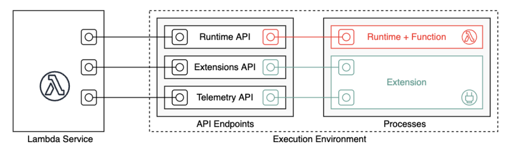
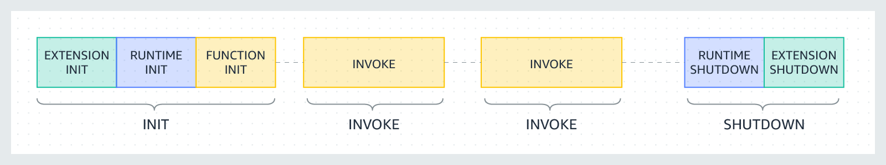
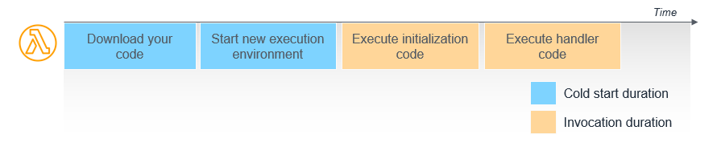

# Firecracker

> _We needed something that could give us the hardware virtualization-based security boundaries of virtual machines, while maintaining the smaller package size and agility of containers and functions._

- 基於 KVM
- 沒有 BIOS (startup times < 125 ms on an i3.metal)

<aside>
💡

https://aws.amazon.com/blogs/opensource/firecracker-open-source-secure-fast-microvm-serverless/

</aside>

# Execution Environment

每個 Execution Environment 都是一個獨立的 Firecracker VM

> This execution environment manages the processes and resources that are needed to run your function. When a function is first invoked, Lambda creates a new execution environment for the function to run in. After the function has finished running, Lambda doesn't stop the execution environment right away; if the function is invoked again, Lambda can re-use the existing execution environment (**Warm start**). ref → https://docs.aws.amazon.com/lambda/latest/dg/concepts-basics.html#gettingstarted-concepts-runtime

## Lifecycle

- Init
- Restore (SnapStart only)
- Invoke
- Shutdown

### Init Phase

1. Start all extensions (`Extension init`)
2. Bootstrap the runtime (`Runtime init`)
3. Run the function's static code (`Function init`)

   1. Outside of the main handler. such as import libraries and dependencies, set up configurations, and initialize connections to other services.
   2. The initialization code is not run again if an invocation uses a warm execution environment.

   ⚠️ The largest contributor of latency before function execution comes from initialization code.

4. Run any before-checkpoint [runtime hooks](https://docs.aws.amazon.com/lambda/latest/dg/snapstart-runtime-hooks.html) (Lambda SnapStart only)

#### Limitation

- The `Init` phase is limited to 10 seconds.  (except for `SnapStart` or `Provisioned Concurrency`)
- https://docs.aws.amazon.com/lambda/latest/dg/lambda-runtime-environment.html#static-initialization
- If the `Init` phase is successful, Lambda doesn't emit the `INIT_REPORT` log unless [SnapStart](https://docs.aws.amazon.com/lambda/latest/dg/snapstart.html) or [provisioned concurrency](https://docs.aws.amazon.com/lambda/latest/dg/provisioned-concurrency.html) is enabled.

### Invoke Phase

> When a Lambda function is invoked in response to a `Next` API request, Lambda sends an `Invoke` event to the runtime and to each extension.

### Shutdown Phase

**Duration limit**: The maximum duration of the `Shutdown` phase depends on the configuration of registered extensions:

- 0 ms – A function with no registered extensions
- 500 ms – A function with a registered internal extension
- 2,000 ms – A function with one or more registered external extensions

If the runtime or an extension does not respond to the `Shutdown` event within the limit, Lambda ends the process using a `SIGKILL` signal.

---

## Cold Start

### Warm Start

Execution Environment 被收掉之前的第二個請求可以直接複用同一個 Execution Environment，稱為 `Warm Start` 。

### Solution

#### SnapStart

- 使用 `Firecracker` 的 snapshot 技術來降低 vm kernel 載入時間，但是僅支援[部分 runtimes](https://docs.aws.amazon.com/lambda/latest/dg/snapstart.html#snapstart-runtimes)。
- Container image 不能用。
- 不能跟 `Provisioned Concurrency` & EFS 同時使用。
- ephemeral storage 不可超過 512MB。

> https://docs.aws.amazon.com/lambda/latest/dg/snapstart.html

### Provisioned Concurrency

- The number of `pre-initialized execution environments` allocated to your function.
- keeps functions initialized and ready to respond in `double-digit milliseconds.`
- Use provisioned concurrency if your application has strict cold start latency requirements that can't be adequately addressed by SnapStart.

---

# event source mapping

> https://docs.aws.amazon.com/lambda/latest/dg/invocation-eventsourcemapping.html

### Pull (_event pollers_)

- [Amazon DocumentDB (with MongoDB compatibility) (Amazon DocumentDB)](https://docs.aws.amazon.com/lambda/latest/dg/with-documentdb.html)
- [Amazon DynamoDB](https://docs.aws.amazon.com/lambda/latest/dg/with-ddb.html)
- [Amazon Kinesis](https://docs.aws.amazon.com/lambda/latest/dg/with-kinesis.html)
- [Amazon MQ](https://docs.aws.amazon.com/lambda/latest/dg/with-mq.html)
- [Amazon Managed Streaming for Apache Kafka (Amazon MSK)](https://docs.aws.amazon.com/lambda/latest/dg/with-msk.html)
- [Self-managed Apache Kafka](https://docs.aws.amazon.com/lambda/latest/dg/with-kafka.html)
- [Amazon Simple Queue Service (Amazon SQS](https://docs.aws.amazon.com/lambda/latest/dg/with-sqs.html)

### Push (**direct triggers**)

- [Tutorial: Using an Amazon S3 trigger to invoke a Lambda function](https://docs.aws.amazon.com/lambda/latest/dg/with-s3-example.html).
- [Tutorial: Using AWS Lambda with Amazon Simple Notification Service](https://docs.aws.amazon.com/lambda/latest/dg/with-sns-example.html).
- [Invoking a Lambda function using an Amazon API Gateway endpoint](https://docs.aws.amazon.com/lambda/latest/dg/services-apigateway.html).

---

Extension 之後再聊～
先附上 API Reference

- [Runtime API](https://docs.aws.amazon.com/lambda/latest/dg/runtimes-api.html)
- [Extension API](https://docs.aws.amazon.com/lambda/latest/dg/runtimes-extensions-api.html)
- [Telemetry API](https://docs.aws.amazon.com/lambda/latest/dg/telemetry-api.html)
