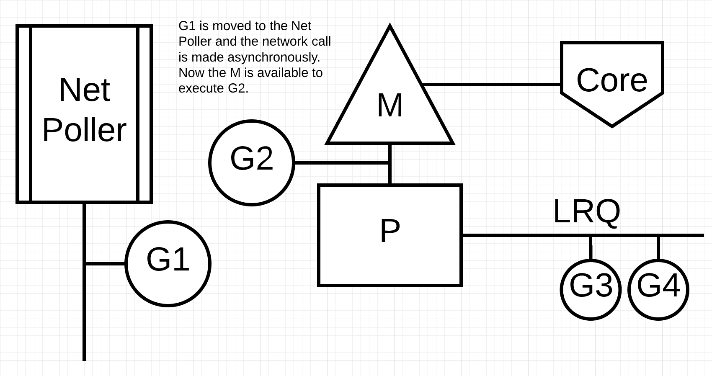

## 前言

#### 以下內容節錄自：

- [Scheduling In Go : Part I - OS Scheduler](https://www.ardanlabs.com/blog/2018/08/scheduling-in-go-part1.html)
- [Scheduling In Go : Part II - Go Scheduler](https://www.ardanlabs.com/blog/2018/08/scheduling-in-go-part2.html)
- [Scheduling In Go : Part III - Concurrency](https://www.ardanlabs.com/blog/2018/12/scheduling-in-go-part3.html)

---

## Definition

- ### Program Counter (Instruction Pointer)

  > allows the Thread to keep track of the next instruction to execute. [example](./example/stack-trace/main.go)

- ### Thread States

  #### Waiting:

  > the `Thread` is stopped and waiting for something in order to continue. This could be for reasons like, waiting for the hardware (disk, network), the operating system (system calls) or synchronization calls (atomic, mutexes).

  #### Runnable:

  > the `Thread` wants time on a core so it can execute its assigned machine instructions.

  #### Executing

  > the `Thread` has been placed on a core and is executing its machine instructions.

- ### Preemptive Scheduler
  > The scheduler is unpredictable when it comes to what Threads will be chosen to run at any given time. The physical act of swapping Threads on a core is called a `context switch`. A context switch can cost you `~12k to ~18k` instructions of latency.

## Go Core

| Symbol | Description                                                                |
| :----: | -------------------------------------------------------------------------- |
|   P    | Logical Processor for every virtual core.                                  |
|   M    | Every `P` is assigned an OS Thread                                         |
|   G    | initial Goroutine (application-level threads)                              |
|  GRQ   | the Global Run Queue for Goroutines that have not been assigned to a P yet |
|  LRQ   | the Local Run Queue per `P`                                                |

### Cooperating Scheduler

A cooperating scheduler means the scheduler needs well-defined user space events that happen at safe points in the code to make scheduling decisions. There are four classes of events:

- The use of the keyword `go`
- Garbage collection
- System calls
- Synchronization and Orchestration

## Net Poller

