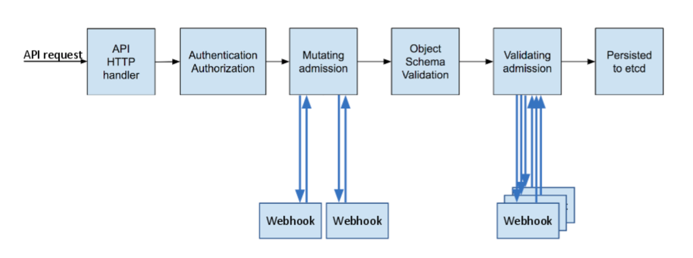
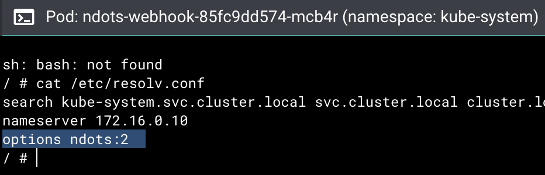

# Concept

Admission Controllers 包含兩種類型：**Mutating Admission** 與 **Validating Admission**。



## 🧩 Mutating Admission（變更型）

Mutating Admission 會在物件進入叢集前攔截請求，並**修改或補全**資源定義。
它通常在所有驗證邏輯執行前觸發，用來確保資源在送入叢集前已符合組織預設設定。

**常見用途：**

- 自動注入 sidecar，例如 Istio 的 Envoy。
- 自動加入預設的 label、annotation、resource limit。
- 將映像路徑改寫為公司內部私有 registry。
- 為 Pod 加上安全設定，例如強制唯讀 root filesystem。

換句話說，Mutating Admission 是叢集的「自動校正層」，負責在資源建立或更新時統一標準化設定。

## 🔍 Validating Admission（驗證型）

Validating Admission 則在 Mutating 階段之後執行，負責**檢查最終版本**的資源是否合法。
若檢查未通過，Kubernetes 會直接拒絕該請求。

**常見用途：**

- 禁止特定 namespace 或使用者建立不合規資源。
- 檢查安全設定，例如禁止 privileged 容器或 root 身份執行。
- 確保資源限制、標籤、命名規則等都符合政策。

這一層相當於叢集的「守門員」，確保任何最終進入 etcd 的物件都符合企業治理與安全要求。

綜合來說，**Mutating Admission** 負責「自動修正」，**Validating Admission** 負責「嚴格審查」；兩者搭配，構成 Kubernetes 在安全、治理與一致性上的核心防線。

---

# Example

以下用經典的 ndots dns resolve 問題為例，來測試 Admission 的效果：

## Issue

每個 Pod 都會有個 `/etc/resolv.conf`，用來控制查詢 domain 的行為，其內容如下

```
nameserver 10.32.0.10
search <namespace>.svc.cluster.local svc.cluster.local cluster.local
options ndots:5
```

**當 domain 的 dot 數量 < ndots 設定值** 或是 **domain 不是 FQDN** 時，就會會依照 search 的順序依序接在 domain 後查詢。

這也是為何呼叫相同 ns/svc 可以只寫 svc name，但跨 ns 時則需要寫出 svc.<namespace>.svc.cluster.local 的原因。

那如果是呼叫 external domain 的情況呢？例如 google.com，則會依序經過以下幾次查詢，並且都得到失敗的結果，因為這些 domain 並不存在。

- google.com.<ns>.svc.cluster.local.
- google.com.svc.cluster.local.
- google.com.cluster.local.

由此可見將 ndots 設為 2 有助於減輕 DNS 的壓力，以下嘗試用 Mutating Admission 來實現這件事。

## Step

1. 備好 [webhook svc](./webhook/)

2. Admission Webhook server 必須以 HTTPS 提供服務，且 kube-apiserver 必須能驗證它的憑證鏈，所以要來準備憑證

   ```sh
   ./scripts/generate-certs.sh ndots-webhook-svc kube-system
   ```

3. 先 create secret

   ```sh
   kubectl create secret tls ndots-webhook-tls -n kube-system --cert=./certs/tls.crt --key=./certs/tls.key
   ```

4. 剩下用 kubectl apply ，記得先 `kustomization.yaml` 的值就可以 apply 了

   ```sh
   kubectl apply -k ./k8s -n kube-system
   ```

5. 隨便 scale 個 pod 出來試試（例如 ndots-webhook 本人）

   

   **成功！**
