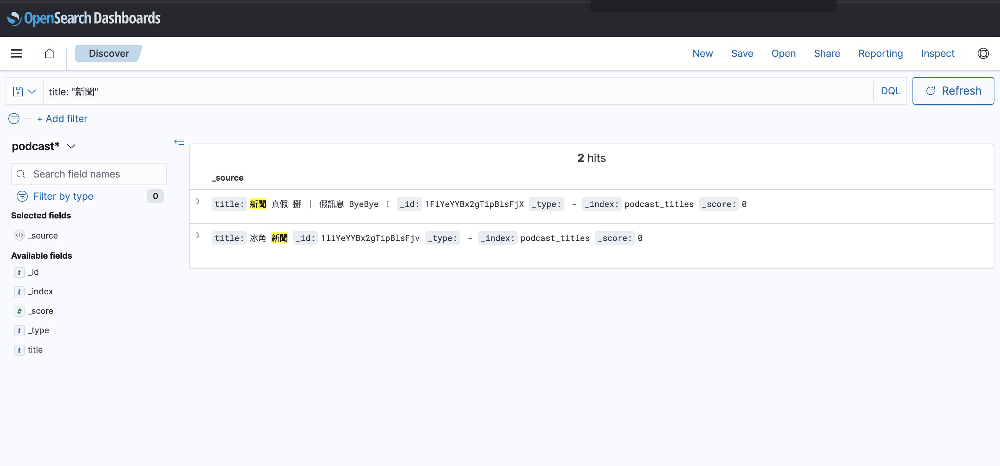

## Warning

vscode 暫時沒辦法跑 jupyter notebook

> [VSCode's 'Jupyter' plugin is broken, causing VSCode unable to bind with python interpreter.](https://stackoverflow.com/questions/75350840/jupyter-notebook-error-jupyter-command-jupyter-notebook-not-found)

## Step

1. run open search

   ```
   docker-compose up -d
   ```

2. run notebook

   ```
   jupyter-notebook
   ```

3. try it

   

## What's Next

分詞品質會影響搜尋結果，繁體中文情境可以試試 [ckiptagger](https://github.com/ckiplab/ckiptagger)。
