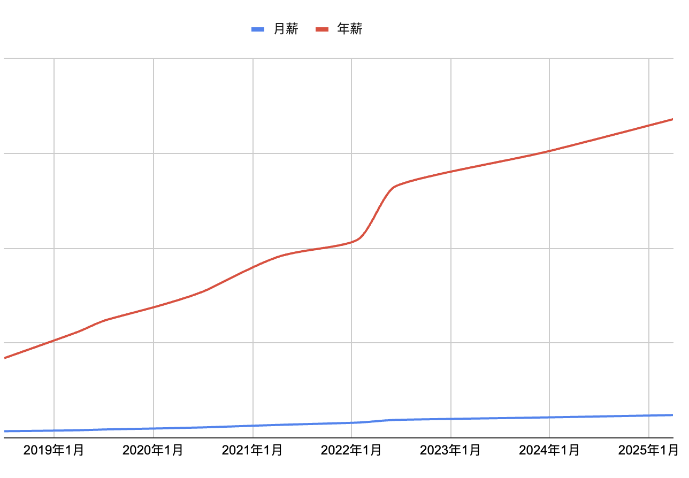
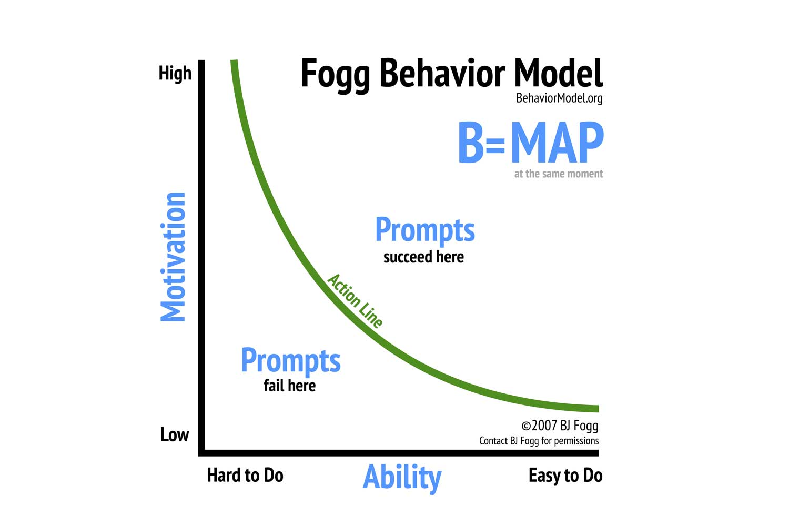
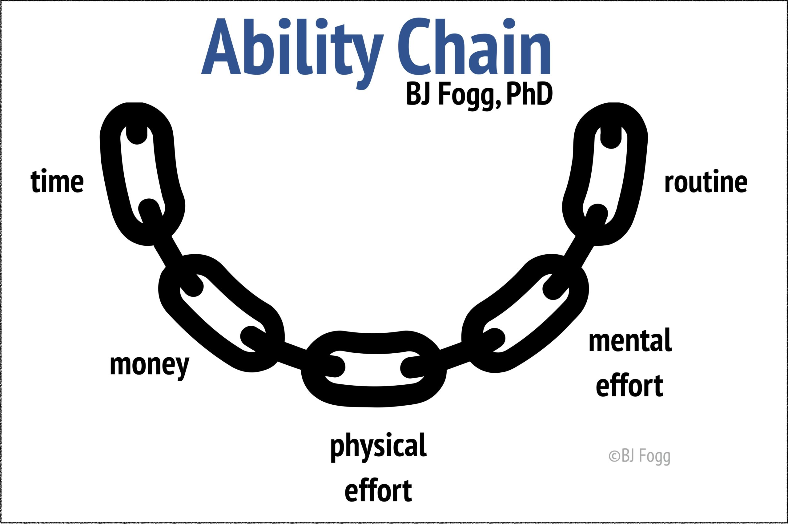
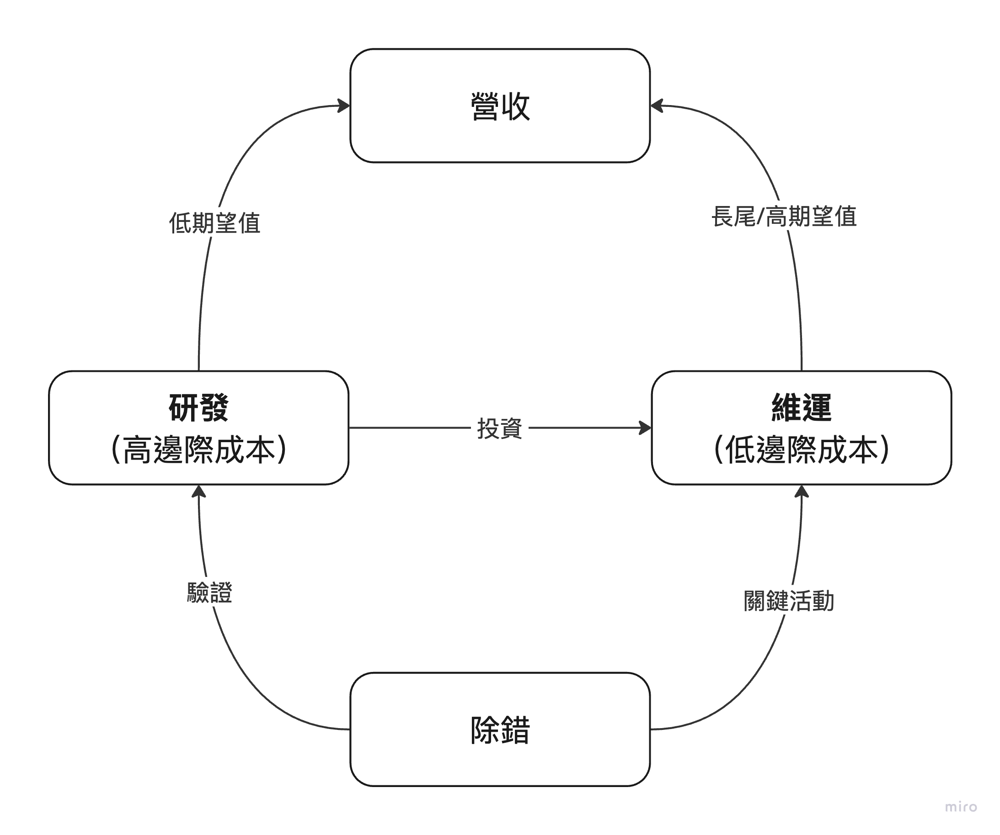

## 前言

年初發起了一個 52 週學習計畫，起因是為了更從容應付來自工作的挑戰，我深信學習是不二法門。一開始沒有特別安排 Roadmap，是打算先建立習慣，再修正方向。然而過完年後突然有感於 GenAI 即將帶來的典範轉移，加上自身角色定位轉變下的雙重夾擊，不禁引發些類似於剛入職時的焦慮。幸好我也不是當年的菜鳥了，這幾年精實的訓練讓我得以調整心態面對未知，出發前順便紀錄工作幾年來建立的觀點，當作下一次修正方向的麵包屑。

---

## 原則

這幾年在職場上建立出屬於我自己的核心原則，也可以說是一切行為背後的最高指導原則，影響範圍也幾乎從工作擴展至整個人生（更貼切的說法可能是工作在我人生中的佔比太高 XD）。

### 等價交換

傳統的說法叫做「種瓜得瓜，種豆得豆」，但由於我很喜歡「鋼之鍊金術師」這部漫畫，甚至可以說是深受劇情啟發，我深信盲目追求只會失去更多，唯有付出代價才能得到。而初入職場的前幾個月我很常問自己願意付出什麼來交換一份成就，答案就像史詩的這句歌詞

> 疏遠了所有人際關係，我沒有空。什麼都沒了那也沒關係，我還有夢......

而隨著工作經驗增加，在幾次調薪/升遷後我對這個概念更加堅信不移。

### 行為至上

行為主義是心理學當中的一個主要流派，主張研究應基於可觀測的行為，而非不可觀測的意識、認知。

#### Motivation-first

早期我很喜歡用 Dr. BJ Fogg 提出的 Behavior Model 來解釋不同對象的行為表現，從針對使用者討論功能易用性，到和下屬聊績效表現都適用。曾經我也深信 `Motivation` 的權重大過 `Ability`，只要願意就做得到任何事。

> "When you really want something, all the universe conspires in helping you to achieve it." --- The Alchemist

#### Ability-first

接任主管前，我心中只有一條策略就是去對齊個人目標與團隊目標，以實現動機極大化。然而我很快就遇到一個問題，不是每個人都有足夠強的動機去對齊組織目標並交付成果，明確的目標及驗收標準仍是必要的管理手段。在這個模式下就如同行為主義所主張的，我們應該關注可觀測的行為（驗收標準是否達成），而非無法觀測的動機。

#### 附個比較

|          | Motivation-first | Ability-first |
| :------: | :--------------: | :-----------: |
|  適用於  |     Partner      |     員工      |
| 管理成本 |        低        |      高       |
| 組織架構 |     Startup      |  Enterprise   |

但不論是動機驅動行為或能力驅動行為，行為至上的精髓在於「採取有價值的行為，創造有價值的成果」，畢竟在營利導向的企業中，價值是獲利的先決條件。

### KISS

> Keep It Simple, Stupid.

個人覺得這沒什麼好解釋的，不過根據經驗保持簡單往往需要比放任生長付出更大心力，心力會被用在從所有可行解中判斷複雜性、排序並作出決定。所以真正的問題是「我現在願意付出多少___來符合 KISS 原則」。

如果用組織的角度來看，底線應該會填入「資源」。而答案有可能是經過冗長且無效的分析後得出的某個數字。我不反對分析，但分析應該要基於可靠的基礎資訊才有意義。當分析基於過多的假設，分析就會淪為試圖說服別人的故事，同時高機率違反了 KISS 原則。

反而言之，這個原則套用在個人身上的效益我認為是更大的，如果願意盡可能的投入心力去符合原則，無形間會讓能力得到顯著提升，畢竟這個過程可沒那麼簡單！

---

## 修煉

### Individual Contributor

我心中簡化過的2B軟體工程活動如下：

「研發」及「維運」分別是兩項營運關鍵活動，「維運」具有主要的經濟效益，「研發」則可以視為一種投資行為，用來降低維運成本。而這兩項活動都依賴「除錯」這項基礎能力。

考慮到邊際成本，維運活動帶來的長尾效應通常才是養活企業的關鍵。研發的價值則是能夠一定比例的降低維運成本，或是少數發展成能夠直接出售的機會。維運活動的日常就是除錯應該沒話說，至於研發也需要透過除錯來驗證可行性，這是因為軟體工程的可靠性是奠基於否證法（falsifiable），我們只能盡可能的提出假設，測試，並拒絕錯誤（正好就是 TDD 的循環）。因此提升除錯能力是從技術層面直接影響到企業營收的關鍵行為。

這裡給所有 IC 的建議是「帶著業績談薪水成功率最高」。找到你認為與營收最相關的行為並全力以赴吧！

> 延伸閱讀：[所有部門都該有自己的「業績目標」](https://www.linkedin.com/posts/sunny-tsao-5a3b0593_%E6%89%80%E6%9C%89%E9%83%A8%E9%96%80%E9%83%BD%E8%A9%B2%E6%9C%89%E8%87%AA%E5%B7%B1%E7%9A%84%E6%A5%AD%E7%B8%BE%E7%9B%AE%E6%A8%99-%E9%80%99%E5%B9%BE%E5%B9%B4%E5%BE%9E%E5%9F%BA%E5%B1%A4%E4%B8%80%E8%B7%AF%E5%81%9A%E8%B5%B7%E4%B8%80%E8%B7%AF%E7%B6%93%E6%AD%B7%E9%81%8E%E6%A5%AD%E5%8B%99%E5%AE%A2%E6%9C%8D-activity-7287653111282774016-9nQR/?originalSubdomain=cn)

### Debug

以下是根據經驗歸納出有效除錯的步驟：

> 描述現況 > 建立假設 > 驗證假設 > 產生結論 > 結案 or 再來一輪

基本上跟科學實驗方法差不多，但各階段的特色稍有不同

- 描述現況講究觀察力，或是說區分「觀點」vs「事實」的能力，也是最重要的環節，畢竟基於錯誤的觀察就會產出錯誤的結論。實務上還有一項關鍵行為可以來預測一個工程師的解題能力，那就是「讀 error message」。撇除沒有 log 的狀況，許多 jr. 不知為何總能忽略顯而易見的 error message，並與答案擦肩而過。

- 將現況描述的越清晰，能建立假設的角度就越多，假設在解題過程中就像子彈，裝填越多發就越有機會命中答案。高品質的假設則像是照明彈，即便沒有命中目標，也會照亮周圍為我們提供更多關於現況的資訊。極少數的狀況是基本資訊極度匱乏時，就只能透過大量的假設來多試幾次，也就是考驗所謂的「通靈能力」。

- 驗證假設可以是最簡單的一步，也能是最難的一步，完全考驗著實作能力。這邊又有分為「實際動手」或「查找資料」兩類。前者是直接執行一段程式碼、在環境中執行某種操作等行為，後者則是查閱文件、文章等方法，以他人記載的結果來驗證假設。兩種方法優劣互補，建議見機行事。

- 產生結論後與原始問題放在一起看，如果仍未得到答案，可以走 BFS 把稍早的其他假設一併驗證，或是走 DFS 根據結論產生新的假設。

其實整個流程很像數獨遊戲，沒有一定要會什麼才能解題，知識量多寡雖會影響解題速度，但這意味著只有有心就能解出，而且過程中會得到額外的知識報酬。

### Management

最後談到了管理，截至目前為止大約一年半的管理經驗中，雖有維持住團隊的產出，但自認尚未發展出值得說嘴的管理成績。今年會嘗試將三大原則昇華成管理基礎並擴散給整個團隊。KISS 原則將阻止我設計複雜的規範及流程、行為至上會將產出視為績效考核的重心，而用績效來換 Promotion 的機會再公平不過了。