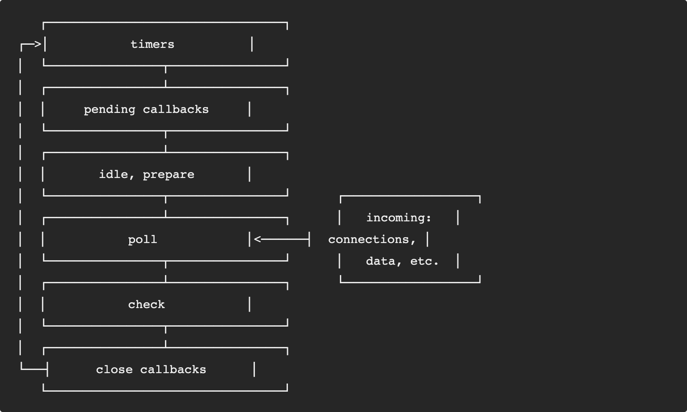
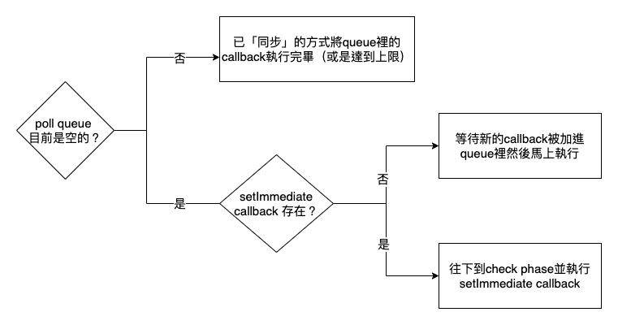
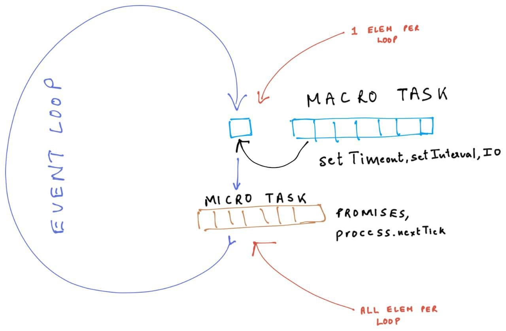

## 前言

最近重讀了[官方文件](https://nodejs.org/en/docs/guides/event-loop-timers-and-nexttick/)後，順手做個簡單的摘要。如果想深入瞭解的人可以參考[非同步程式碼之霧：Node.js 的事件迴圈與 EventEmitter](https://www.yottau.com.tw/article/73) ＆ [Eventloop in NodeJS: MacroTasks and MicroTasks](https://medium.com/dkatalis/eventloop-in-nodejs-macrotasks-and-microtasks-164417e619b9)

---

## 正文

先來張官方圖



這張圖呈現了一個完整的 event loop，其中`timers`到`close callbacks`共有六個`phase`，每個 phase 都有獨立的 queue(FIFO)，各自負責不同的`callback`，原則上當所有 callback 執行完後，就會走到下一個 phase。以下來介紹幾個比較重要的 phase

- ### timers

  負責執行`setTimeout`跟`setInterval`的 callback。

- ### poll

  除了一些網路相關的 I/O，大部分的 I/O callback 都在這個階段執行。每次進到這個 phase 都會以下圖的流程執行。
  

  除此之外每次 poll queue 被清空時，event loop 都會檢查是否有計時器到期，如果有就會回到`timers`去執行`setTimeout`跟`setInterval`的 callback。

- ### check
  負責執行`setImmediate`的 callback。

用 phase 來理解 event loop 雖然很清楚，但是目前為止卻還沒提到實際上最常見的異步寫法 —— `promise`，以下就換個角度來重新看看 event loop。



先介紹兩個新名詞

- #### MacroTask —— `setTimeout`, `setInterval`, `setImmediate`, `I/O`...
- #### MicroTask —— `process.nextTick`, `promise`, ...

簡單來說，各種實現異步的寫法如果不是 MacroTask 就是 MicroTask。而每執行一個 MacroTask 之後，就會把 MicroTask Queue 全部清空，才會再執行下一個 MacroTask。對應到官方的說明，如果遞迴呼叫`process.nextTick`，會讓 event loop 卡死在某一個 phase，正是因為 MicroTask 的特性造成的。

最後來個實測

```javascript
console.log("start");

setTimeout(() => {
  console.log("setTimeout");
}, 0);

setImmediate(() => {
  console.log("setImmediate");
});

Promise.resolve().then(() => {
  console.log("promise 1");
});

Promise.resolve().then(() => {
  console.log("promise 2");
});

process.nextTick(() => {
  console.log("nextTick");
});

console.log("end");
```

執行結果

```
> start
> end
> nextTick
> promise 1
> promise 2
> setTimeout
> setImmediate
```
