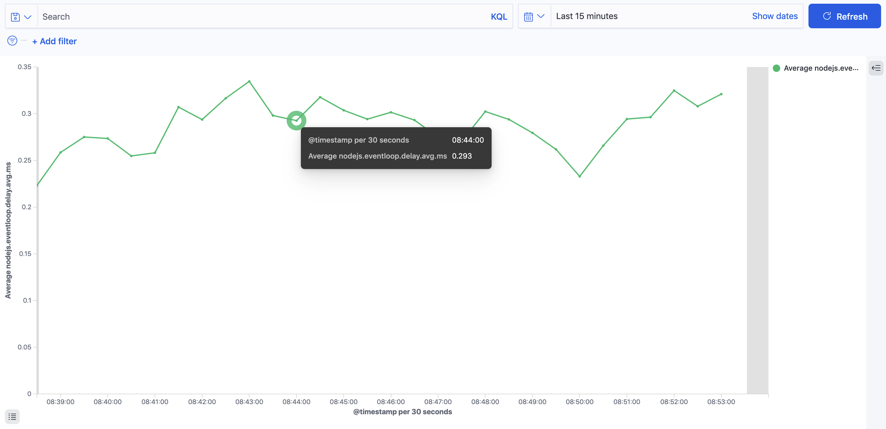

## 前言

最近重讀了[官方文件](https://nodejs.org/en/docs/guides/event-loop-timers-and-nexttick/)後，順手做個簡單的摘要。如果想深入瞭解的人可以參考[非同步程式碼之霧：Node.js 的事件迴圈與 EventEmitter](https://www.yottau.com.tw/article/73) ＆ [Eventloop in NodeJS: MacroTasks and MicroTasks](https://medium.com/dkatalis/eventloop-in-nodejs-macrotasks-and-microtasks-164417e619b9)

---

## 正文

先來張官方圖


這張圖呈現了一個完整的 event loop，其中`timers`到`close callbacks`共有六個`phase`，每個 phase 都有獨立的 queue(FIFO)，各自負責不同的`callback`，原則上當所有 callback 執行完後，就會走到下一個 phase。以下來介紹幾個比較重要的 phase

- ### timers

  負責執行`setTimeout`跟`setInterval`的 callback。

- ### poll

  除了一些網路相關的 I/O，大部分的 I/O callback 都在這個階段執行。每次進到這個 phase 都會以下圖的流程執行。
  

  除此之外每次 poll queue 被清空時，event loop 都會檢查是否有計時器到期，如果有就會回到`timers`去執行`setTimeout`跟`setInterval`的 callback。

- ### check
  負責執行`setImmediate`的 callback。

用 phase 來理解 event loop 雖然很清楚，但是目前為止卻還沒提到實際上最常見的異步寫法 —— `promise`，以下就換個角度來重新看看 event loop。


先介紹兩個新名詞

- #### MacroTask —— `setTimeout`, `setInterval`, `setImmediate`, `I/O`...
- #### MicroTask —— `process.nextTick`, `promise`, ...

簡單來說，各種實現異步的寫法如果不是 MacroTask 就是 MicroTask。而每執行一個 MacroTask 之後，就會把 MicroTask Queue 全部清空，才會再執行下一個 MacroTask。對應到官方的說明，如果遞迴呼叫`process.nextTick`，會讓 event loop 卡死在某一個 phase，正是因為 MicroTask 的特性造成的。

最後來個實測

```javascript
console.log("start");

setTimeout(() => {
  console.log("setTimeout");
}, 0);

setImmediate(() => {
  console.log("setImmediate");
});

Promise.resolve().then(() => {
  console.log("promise 1");
});

Promise.resolve().then(() => {
  console.log("promise 2");
});

process.nextTick(() => {
  console.log("nextTick");
});

console.log("end");
```

執行結果

```
> start
> end
> nextTick
> promise 1
> promise 2
> setTimeout
> setImmediate
```

---

## 補充

如果使用[Elastic APM](https://www.elastic.co/apm/)來做runtime monitor，他會自動紀錄[event loop delay](https://www.elastic.co/guide/en/apm/agent/nodejs/master/metrics.html#metric-nodejs.eventloop.delay.avg.ms)，搭配適當的filter跟其他metrics，可以幫忙找出有問題的程式碼。



實作的部分寫在[monitor-event-loop-delay](https://github.com/elastic/monitor-event-loop-delay)這個套件裡。

主要的邏輯很簡單，透過一個`setInterval`來紀錄每次`callback`被執行的時間差。
```js
  enable () {
    if (this.timer) return false

    let last = process.hrtime()

    this.timer = setInterval(() => {
      const next = process.hrtime(last)
      this.samples.push(Math.max(0, toNano(next)))
      last = process.hrtime()
    }, this.resolution)

    this.timer.unref()

    return true
  }
```

官方有提到`resolution`的值是10ms，所以小於這個值的delay將不會被捕捉到。


> Event loop delay is sampled every 10 milliseconds.Delays shorter than 10ms may not be observed.


另外取得時間的API是使用[process.hrtime](https://nodejs.org/api/process.html#process_process_hrtime_time)，可以提供奈米級的高精度時間。

> The `process.hrtime()` method returns the current high-resolution real time in a `[seconds, nanoseconds]` tuple Array, where nanoseconds is the remaining part of the real time that can't be represented in second precision.
>
> These times are relative to an arbitrary time in the past, and not related to the time of day and therefore not subject to clock drift. The primary use is for measuring performance between intervals.