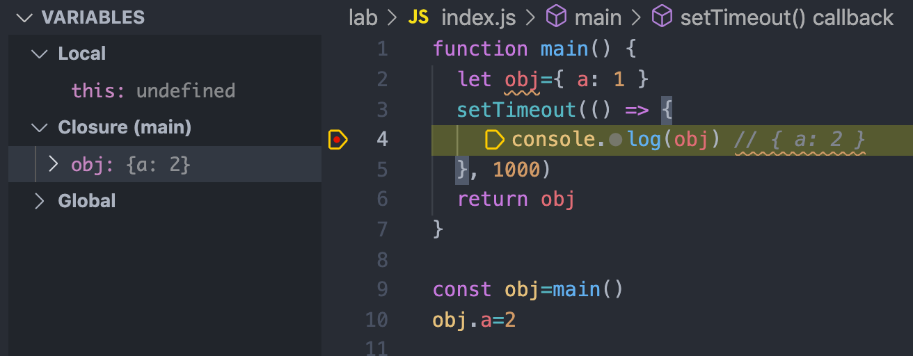

## 跟 Memory 有關的一些事


ECMAScript 定義了 7 種 type，除了`object`之外的都是`primitive type`，這類型變數的`value`會直接存在`stack`裡，至於`object`類型在`stack`中存的則是一個指向`heap`的`memory address`。

來做幾個實驗看看

```js
let x = 1;
let y = x;

x = 2;
console.log(x, y); // 2, 1

y = 3;
console.log(x, y); // 2, 3
```

因為 x, y 的值各自存在`stack`裡，因此對 x, y 重新賦值不會互相影響。

```js
let x = { a: 1 };
let y = x;

x.a = 2;
console.log(x, y); // { a: 2 } { a: 2 }

y.a = 3;
console.log(x, y); // { a: 3 } { a: 3 }

x = 1;
console.log(x, y); // 1 { a: 3 }
```

因為 x, y 存在`stack`裡的值是一個指向到`heap`的`memory address`，因此改動 x 或 y 會改到同一個 object，但如果對 x 重新賦值只會改掉 x 在`stack`裡存的東西，不會影響到 y。

上面的兩個例子算是順便說明了 function 的`call by sharing`行為，其實`return`的時候也是`by sharing`，只是跟`call`比起來不太重要就是了 XD

```js
function main() {
  let obj = { a: 1 };
  setTimeout(() => {
    console.log(obj); // { a: 2 }
  }, 1000);
  return obj;
}

const obj = main();
obj.a = 2;
```

BTW，上面這種讓某個`scope`中的變數被引用到其他地方的寫法就會產生傳說中的`closure`。


## 延伸閱讀

[What and where are the stack and heap?](https://stackoverflow.com/questions/79923/what-and-where-are-the-stack-and-heap)

[深入探討 JavaScript 中的參數傳遞：call by value 還是 reference？](https://blog.techbridge.cc/2018/06/23/javascript-call-by-value-or-reference/)
