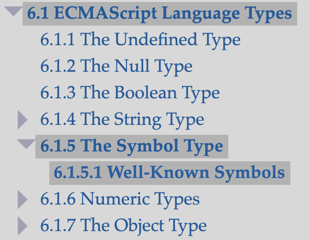

## 跟Memory有關的一些事




ECMAScript定義了7種type，除了`object`之外的都是`primitive type`，這類型變數的`value`會直接存在`stack`裡，至於`object`類型在`stack`中存的則是一個指向`heap`的`memory address`。

來做幾個實驗看看
```js
let x=1
let y=x

x=2
console.log(x, y) // 2, 1

y=3
console.log(x, y) // 2, 3
```
因為x, y的值各自存在`stack`裡，因此對x, y重新賦值不會互相影響。


```js
let x={ a: 1 }
let y=x

x.a=2
console.log(x, y) // { a: 2 } { a: 2 }

y.a=3
console.log(x, y) // { a: 3 } { a: 3 }

x=1
console.log(x, y) // 1 { a: 3 }
```
因為x, y存在`stack`裡的值是一個指向到`heap`的`memory address`，因此改動x或y會改到同一個object，但如果對x重新賦值只會改掉x在`stack`裡存的東西，不會影響到y。

上面的兩個例子算是順便說明了function的`call by sharing`行為，其實`return`的時候也是`by sharing`，只是跟`call`比起來不太重要就是了XD
```js
function main() {
  let obj={ a: 1 }
  setTimeout(() => {
    console.log(obj) // { a: 2 }
  }, 1000)
  return obj
}

const obj=main()
obj.a=2
```

BTW，上面這種讓某個`scope`中的變數被引用到其他地方的寫法就會產生傳說中的`closure`。


## 延伸閱讀

[What and where are the stack and heap?](https://stackoverflow.com/questions/79923/what-and-where-are-the-stack-and-heap)

[深入探討 JavaScript 中的參數傳遞：call by value 還是 reference？](https://blog.techbridge.cc/2018/06/23/javascript-call-by-value-or-reference/)