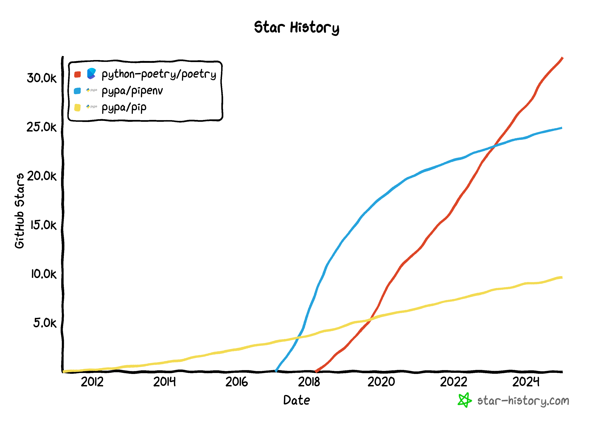

## 前言

多年以來，如果說 Python 的語法有多簡單，他的套件管理就有多複雜。對於那些吵著說 python 很好寫的可愛工程師們我一向不予置評。寫寫本地執行的腳本倒還好，一但要包成 image 或上到 lambda 之類的 production 環境根本就是惡夢，python 榮登我最不想碰的語言且蟬聯多年。逃避歸逃避，但工作還是要做，再說大 AI 時代來臨後，好像已經無路可逃（？）那就只好來面對他了 QQ

---

## 基本觀念

- **Module vs Package**

  > 單一 .py 就是 module，包含 `__init__.py` 的目錄就是 package（Regular）

  ```
  parent/
      __init__.py
      one/
          __init__.py
      two/
          __init__.py
      three/
          __init__.py
  ```

- **Q: 什麼是 `__ini__.py`**

  > python 3.2 之前只有一種 regular package，也就是目錄底下要有 `__init__.py` 才能被 import。 但 3.2 之後多了一種 namespace package，基本上就是類比成 [npm scope package](https://docs.npmjs.com/cli/v9/using-npm/scope)。

- **Q: 什麼是 `sys.path`**

  > Python 在載入套件時會搜尋的路徑

- **Q: 什麼是 site-packages**

  > 基本上就是 node_modules

- **Q: 什麼是 PYTHONPATH**
  > Python 會看這個環境變數然後把值加到 sys.path 中

## 環境管理

2025 年看起來 Poetry 陣營是大獲全勝


**常用的指令：**

```bash
$ poetry new <project-name> # Create a new project

$ poetry add <library>

$ poetry remove <library>

$ poetry run <script> # defined in [tool.poetry.scripts]

$ poetry shell # spawn a shell with env

$ poetry config virtualenvs.create false # create .venv or not

$ poetry config virtualenvs.in-project true # create .venv under project directory

$ poetry config --list # show current config

$ poetry env use <version> # specify python version

$ poetry export --without-hashes --format=requirements.txt > requirements.txt
```

在用 poetry env use 指定版本時發現他只會檢查到 minor 版，假設我實際只有 3.11.10 / 3.12.6 三個版本，指定 3.11.1 or 3.12.1 也會不會報錯，但是用 `poetry env info` 顯示出來的還是 3.11.10 or 3.12.6。至於指定一個不存在的 minor 版則會報錯：`Could not find the python executable python3.10`。如果需要多個版本可以用 pyenv 安裝：

```bash
$ pyenv install -l # show all available versions

$ pyenv versions # show installed versions
```

## Reference

- https://dboyliao.medium.com/python-%E5%B0%8F%E6%8A%80%E5%B7%A7-namespace-package-9587368e5329

- https://ithelp.ithome.com.tw/articles/10195501
