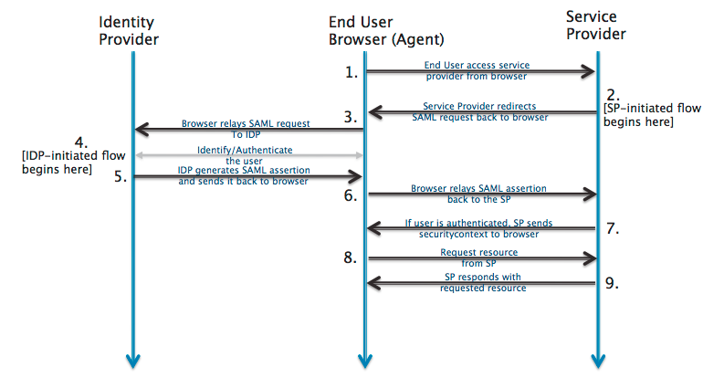
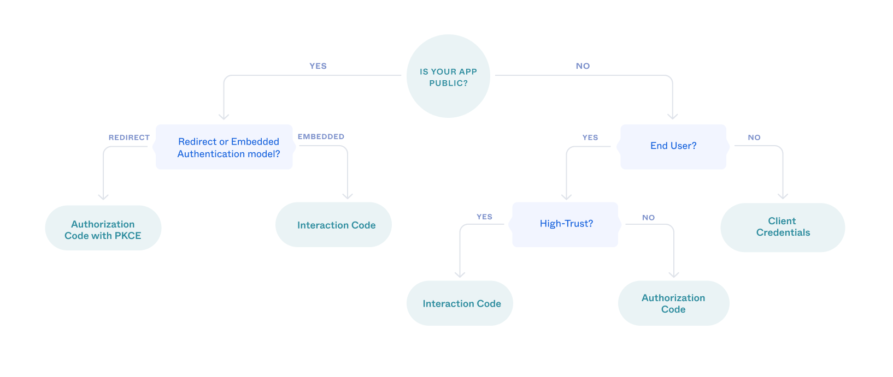

## 做 SSO 的好處

1. 密碼管理簡化：當用戶必須管理多個密碼時，他們往往會選擇簡單或重複使用的密碼，這使得帳戶更容易受到攻擊。
1. 提高密碼強度/MFA：承上，組織可以要求強密碼政策或是綁定 MFA。
1. 簡化帳戶管理：當員工離職時，只需在 SSO 系統中刪除帳戶，降低了因為未能及時撤銷訪問權限而導致的安全風險。也讓帳戶監控更容易執行。
1. 實時監控與異常檢測
   行為分析：許多 SSO 解決方案提供行為分析功能，可以監控用戶活動並檢測異常行為。如果系統檢測到可疑活動，可以立即採取措施，例如鎖定帳戶或要求額外驗證 12。這種主動防護措施有助於及早發現潛在的安全威脅。

## Solution

### SAML
Security Assertion Markup Language 於 2002 年由 [OASIS](https://zh.wikipedia.org/wiki/%E7%B5%90%E6%A7%8B%E5%8C%96%E8%B3%87%E8%A8%8A%E6%A8%99%E6%BA%96%E4%BF%83%E9%80%B2%E7%B5%84%E7%B9%94) 提出，2005 年釋出 SAML2.0 成為標準。Assertion 是指紀錄了驗證資訊的 XML 檔案。

ref: https://developer.okta.com/docs/concepts/saml/#plan-for-saml

### OAuth
OAuth 的 Auth
2010 由 [IETF](https://zh.wikipedia.org/zh-tw/%E4%BA%92%E8%81%94%E7%BD%91%E5%B7%A5%E7%A8%8B%E4%BB%BB%E5%8A%A1%E7%BB%84) 提出，2012 釋出 OAuth 2.0 修復了 1.0 的漏洞。

#### Keyword
- **Client**: The app that wants to access some data.
- **Resource server**: The API or app that stores the data the client wants to access.
- **Resource owner**: The owner of the data on the resource server. For example, you're the owner of your Facebook profile.
- **Authorization server**: The server that manages access and issues access tokens.
- **OAuth 2.0 grant**: The authorization given (or granted) to the client by the user. Examples of grants are `Authorization Code` and `Client Credentials`. Each OAuth grant has a corresponding flow.
- **access token**: The token issued by the authorization server in exchange for the grant.
- **refresh token**: An optional token that is exchanged for a new access token if the access token has expired.

ref: https://developer.okta.com/docs/concepts/oauth-openid/#choose-an-oauth-2-0-flow

### OIDC

OAuth 的設計目的是允許 `Client` 代表 `User/Resource owner` 訪問受保護的資源 `Resource Server`，而非取得用戶身份（雖然 email / name 等廣義來說也可以算是 resource ...?）。因此基於 OAuth 又發展出了 OIDC，主要就是 response 中多了 `ID Token`。

## Reference
- https://developer.okta.com/docs/concepts/saml/
- https://developer.okta.com/docs/concepts/oauth-openid/
- https://www.oauth.com/playground/