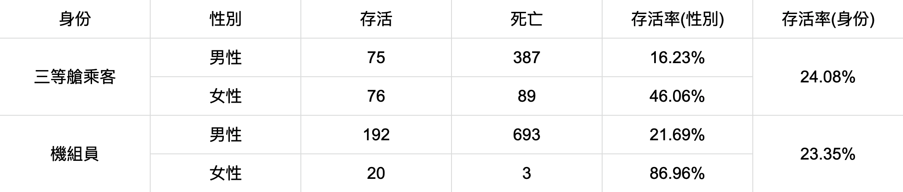

## 辛普森悖論（Simpson's Paradox）

鐵達尼號機組員的存活率是 23.35%，而在客輪底層最難逃生的三等艙乘客（以下簡稱乘客）存活率為 24.08%。但若加上將性別獨立開來，會發現男性機組員的存活率(21.69%)大於男性乘客(16.23%)，女性機組員的存活率(86.96%)也大於女性乘客(46.06%)。

發生悖論的原因在於「性別比例不均」。若觀察乘客族群，女性存活率是男性的 2.84 倍，而機組員族群中則是 4 倍。然而在乘客族群中，男性人數是女性的 2.8 倍，至於機組員族群中則高達 38.5 倍。因此儘管在性別分組下，機組員族群有著更高的存活率，一旦合併之後就會受到性別權重的影響，導致整體存活率低於乘客族群。

在這個案例中機組員與乘客的身份是無法改變的，但若在其他分組可控的情境中（例如藥效實驗），就需要謹慎思考分組情況是否會影響實驗結果。

#### 案例節錄自： [暗數據：被看到、被聽到、被測量到的，往往不是「真凶」](https://www.books.com.tw/products/0010892512)

#### 同場加映：[用決策樹判斷變項影響力](./main.ipynb)
