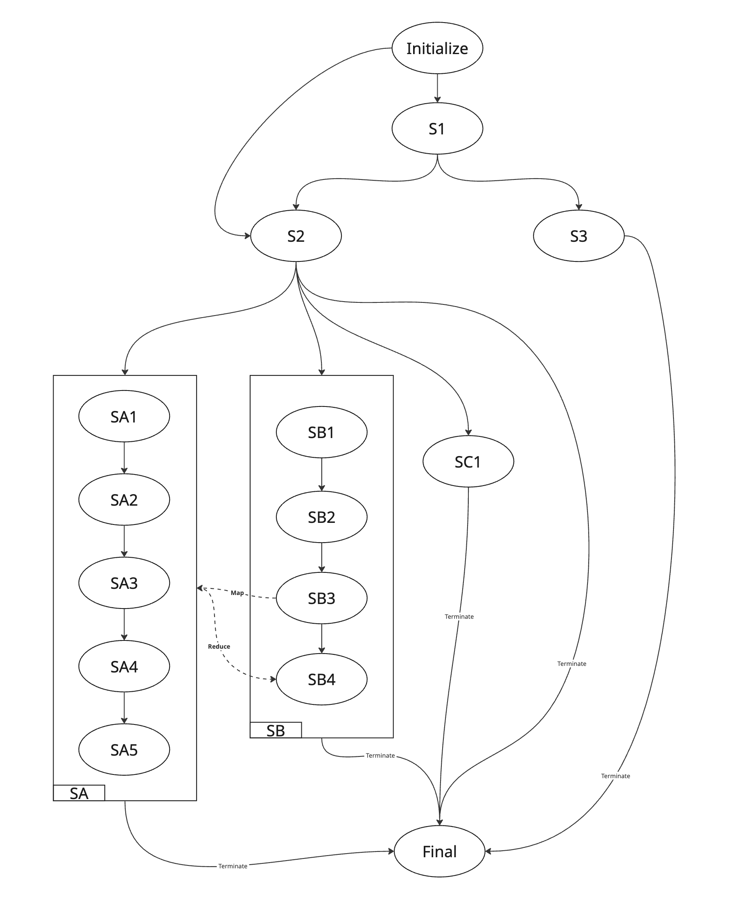

## 前言

最近剛好在實作一項流程有點複雜的功能，順便了複習狀態機的概念，也嘗試了幾種不同的架構（Event-Driven / FSM / Imperative Flow Control）。偏理論的東西不談，這篇主要紀錄實作上思考的面向及心得。

## Scenario

主要流程如下圖所示（針對單一狀態的條件控制及例外處理就不特別標示）

可以看到有兩個主要的子狀態 SA & SB，且 SB3 & SB4 是一個 Map-Reduce 的架構，SB3 會 spawn 出多個 SA 後再往下走到 SB4。

另外每個狀態的開始及結束都要發送通知，並且後面的狀態會依賴先前的 Output。

## Solution

1. **Imperative Flow Control**

   嚴格來說還沒寫一半就先放棄了，套一下 SonarQube 的 [Cognito Complexity](https://www.sonarsource.com/resources/cognitive-complexity/) 隨便都會超過。不管怎麼拆 state action / child states，都免不了最後組合時產生的複雜度。

2. **Event-Driven**

   身為一個 JS 開發者一定有考慮過 EventEmitter。但很快就面臨一些設計上的問題，例如：我是要讓每一個 State 繼承 EventEmitter，還是讓整個 Machine 繼承 EventEmitter？如果是前者，那就還是需要再一個 Dispatcher 的角色來管理 Event。如果是後者那為什麼不就做成狀態機就好？？

3. **StateMachine**

   StateMachine 其實也算是 Event-Driven 的一種特化，只不過從關注**短暫的** Event 轉變成關注**穩定的** State，同時任意時間點只能處於一個狀態的限制也避開了 race condition 的問題。 秉持著不要重複造輪的精神，首先嘗試了看起來最有名氣 ~~SEO 做最好~~ 的 [xstate](https://xstate.js.org/)。

   xstate 畢竟是一個成熟通用的套件，在提供許多功能的同時對我的使用情境來說又有點 Over Design 了。以下列幾個體感不佳的點：

   - Nested Config 太多層，雖然有 Type Hint，但 Type System 本身也過於複雜，Generic 動輒十幾個參數。
   - 設計用 ID / Name 來 Reference，但沒有自動 Inference，防不了 Typo 或各種 Static Error。
   - Action 管理偏複雜，光要處理邏輯就有三種方式：entry/exit, invoke and actor，加上一些 sync / async 或是 context immutable 的限制，導致整個使用成本又高了一層。
   - 很標準的 state / event / transition 缺一不可。雖然這些是狀態機的經典元素，但一樣受限於現實面，沒有經過充分設計的狀態機可能只會造成負擔，或是全部用 `always` 取代 event。
   - `@xstate/test` 標榜可以做一些全自動路徑測試，但我連跑官方的 Toggle example 都卡在 `TypeError: Cannot read properties of undefined (reading 'nextEvents')`，實在沒有心情往下研究。

   整套體驗完最大的好處是可以直接產圖，雖然其他方面體驗不佳，但就這點我個人還是給予高度評價的。

   綜合來說我的需求是：

   - 靜態型別約束，降低自由度就可以增加穩定性。
   - 設定越簡單越好，甚至能作為 Code-First Document。
   - 支援類似 xstate 的 entry / exit / guard，讓邏輯能更解耦。

   最終產物就是一個 `flow-driven` 的 [FSM](./fsm/fsm.ts)。
